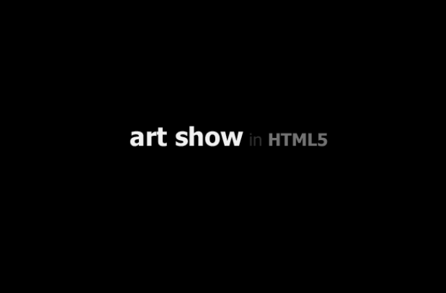
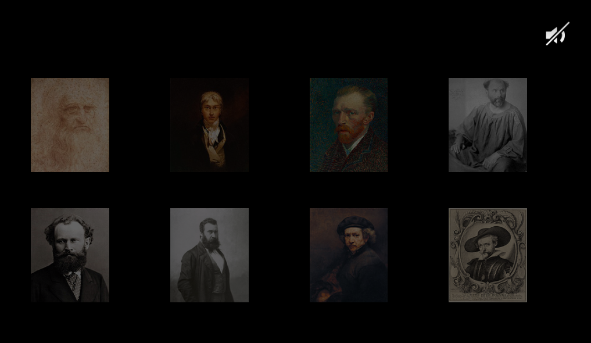
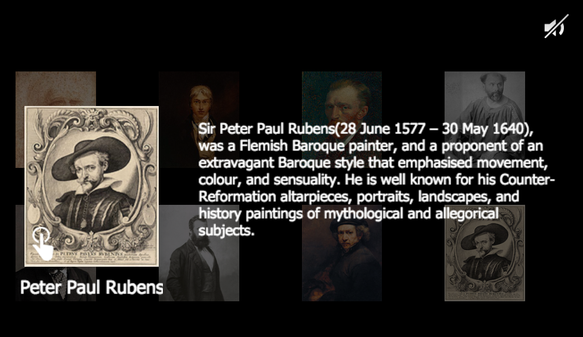
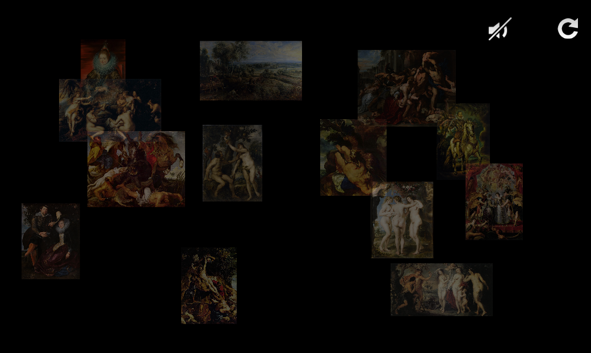
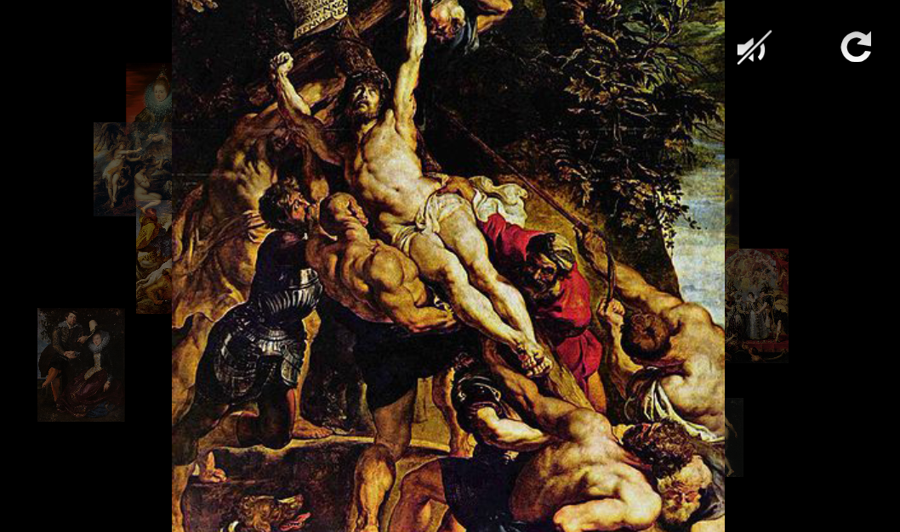

 
=========
- 한국어가 가능하신 분은 [한글 문서](./ko.md)를 이용해주세요.

---

## artshow?

artshow is dynamic artshow application by [cocos2d-js](https://github.com/cocos2d/cocos2d-js) and licensed under [MIT](./LICENSE).

It supports cross-browser(Chrome, Safari, Firefox, IE9+ and etc) and cross-platform(Web, iOS, Android, Mac, Etc).

Every resource is from [Wikipedia](http://en.wikipedia.org/wiki/Main_Page) and their licensing is [public domain](http://commons.wikimedia.org/wiki/Public_domain).

Just play it now!

---

## Online Play

- [http://htmlfive.co.kr/artshow/](http://htmlfive.co.kr/artshow/)

---

## Cocos2d-JS Version

It based on [Cocos2d-JS v3.1 Customized Version](http://cocos2d-x.org/filecenter/jsbuilder/).

- core

- webgl

- actions

- audio

- menus

- render-texture

- sprite-batch-node

- labels

- progress-timer

- transitions

It only contains Cocos2d-JS web engine.

If you want to make native application, you need Cocos2d-JS full package please refer to [cocos2d-js](https://github.com/cocos2d/cocos2d-js).

---

## Screenshot

 

 

 

 
